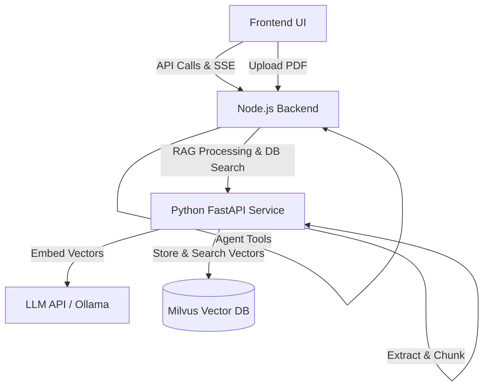

# AgentPlayground

A conversational AI agent platform built with **React + Tailwind** (frontend), **Express + pi-coding-agent** (backend Node.js), and **FastAPI** (Python RAG Service). Supports real-time streaming, multi-model switching, session branching, custom agent routing, and an advanced Retrieval-Augmented Generation (RAG) pipeline via Milvus.

---

## Features

- 🤖 **Multi-model support** — Switch between LLM providers (Ollama, OpenAI, vLLM, etc.) via `models.json`
- 💬 **Real-time streaming** — SSE-based token streaming with think/reasoning display
- 🌿 **Session branching** — Edit messages to create branches, navigate with ← → arrows
- 🚀 **Advanced RAG Pipeline** — Upload PDFs and text files to a dedicated Python Microservice, featuring Anthropic's Contextual Chunking and Milvus Vector Search.
- 🔀 **Agent routing** — `/agent <id>` to switch agent context, `/agents` to list available agents
- 📁 **Agent management** — Create, configure, and delete agents with a built-in file editor
- 🧠 **Skills system** — Agents can have nested skill directories with collapsible folder tree UI
- 💾 **Session persistence** — All sessions saved as JSONL, restorable after refresh

---

## Quick Start (Docker - Recommended)

The easiest way to get everything running (Frontend, Node.js Backend, Python RAG Service, and Milvus Stack) is through Docker.

### Prerequisites
- **Docker Compose**
- **LLM backend** — e.g. [Ollama](https://ollama.ai) running locally on port 11434 with `qwen3-embedding:0.6b` and `qwen3:8b` pulled.

```bash
# Build and start all services
docker compose up --build
```

Then visit **http://localhost:8080** in your browser.

> [!IMPORTANT]
> **Host Networking**: By default `docker-compose.yaml` uses `host.docker.internal` to reach your local Ollama instance on port 11434. 

---

## Local Development (Without Docker)

You can run the web UI and Node backend locally, but the RAG system and Milvus still require Docker.

### Prerequisites
- **Node.js** ≥ 22
- **pnpm** ≥ 10
- **Python** ≥ 3.12 (For RAG Server if ran without Docker)

```bash
# Install Node dependencies (from project root)
pnpm install

# Start Node.js backend (port 3001)
cd backend
pnpm dev

# Start frontend (port 5173, in a separate terminal)
cd frontend
pnpm dev
```

Open **http://localhost:5173**.

---

## Architecture & Data Flow



### Persistent Data Locations

| Path | Description |
|---|---|
| `backend/memory/` | Session JSONL files and Local PDF Document Cache |
| `agents/` | Agent configuration folders & skills |
| `volumes/milvus/` | Milvus Database persistent vectors |

---

## Slash Commands

Available natively in the chat input:

| Command | Description |
|---|---|
| `/agents` or `/agent list` | List available agents |
| `/agent <id>` | Switch active agent for the session |
| `/agent <id> <message>` | One-off message routed to a specific agent |
| `/agent default` | Reset to default (no agent) mode |

---

## Configuration

### Adding Language Models
Edit `backend/models.json` to add new generation LLM providers.

### Modifying RAG Chunking Strategy
Edit the Environment variables in `docker-compose.yaml` under `python-rag` service:
- `CHUNK_METHOD`: `contextual` (global lightweight prepending) or `anthropic` (heavyweight contextual retrieval chunks).
- `CHUNK_SIZE`: Default `800`.
- `CHUNK_OVERLAP`: Default `150`.
- `EMBEDDING_API_URL`: Support both OpenAI compat (`/v1/`) and Native Ollama (`/api/`) endpoints dynamically.
- `SUMMARY_LLM_MODEL`: The LLM used to generate context.
- `SUMMARY_LLM_API_BASE`: API base URL for the summary LLM.
- `SUMMARY_LLM_API_KEY`: API key for the summary LLM.
> Note: The `SUMMARY_LLM_*` variables are only utilized when `CHUNK_METHOD` is set to `anthropic` or `contextual`.

---

## License

[MIT](LICENSE)
